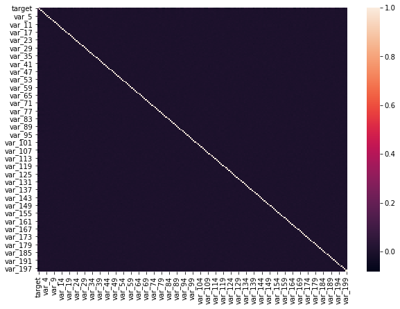
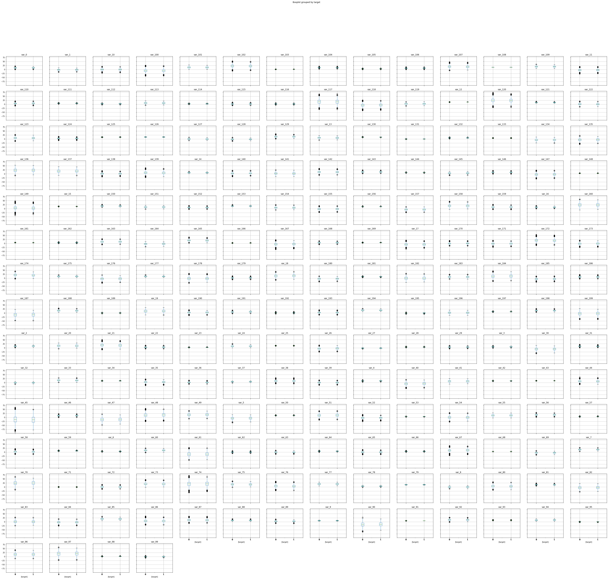
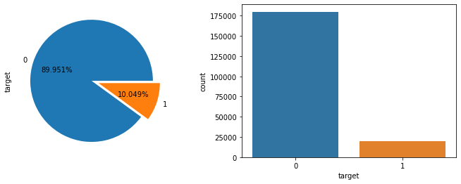

# Predictive Neuronal Network Machine Learning - Santander Analytics

- [link: ***Deployment of webpage and app***](<https://santander-predictor.herokuapp.com/>)

## Background
We are developing an app for Santander with a Neuronal Network (ML) that helps the bank identify if a client will make a transaction of their product/services based on 200 variables of past behavioral decisions collected from 200,000 clients. 

## Mission
Our mission is to help Banco Santander identify from 200000 internal custormers, who will make a transaction based on 200 variables from past behavioral decision. We found that a Neuronal Network Machine learning was the best model in this case in order to make an app that solves their most common challenge on classification of variables such as: is a customer satisfied? Will a customer buy this product? Can a customer pay this loan? We will try to surpass the current results comparig different models precision and accuracy. With this app Santander will know in advance which products and services might a certain customer want and  help them achieve their monetary goals.

## Dataset
We found a Dataset from Santander that invites Kaggler´s to participate on a competition (with monetary compensation to the winner) to help identify which customers will make a transaction. The dataset contains a train.csv and a test.csv which are anonymized for privacy affairs. You can find the dataset on the next link:
https://www.kaggle.com/c/santander-customer-transaction-prediction

## The Challenge
We will solve a binary classification problem:
INPUT: Will the customer will make a transaction?
OUTPUT: Yes/No
This binary problem solves questions like: is the customer satisfied? Will a customer buy this product? Can a customer pay this loan?
With our Machine Learnig Algorythm - Neuronal Network we will Identify which customers will make a specific transaction in the future, irrespective of the amount of money transacted or not.

## Model
We chose to run a neuronal network with the following structure:
Model: "sequential"
Tuning:

## Data preprocessing
1. Variables does show very low correlation among them, meaning that variables are independent. Variables while plotting them in box plots show outliers that mainly are coming from target "1" data. The following table show the variables with the highest correlation:
 

:-----:|:-----:
**Variable**|**Correlation**
var_81   |   0.080917
var_139  |   0.074080
var_12   |   0.069489
var_6    |   0.066731
var_110  |   0.064275

 

3. Variables were passed through a Standard Scaler before fitting them into the model.

5. Tune and balance the dataset.

## Dataset testing results
- **Dataset**
- 2 outputs
    - 0 = No transaction
    - 1 = Transaction
- 200 variables
- 200000 customers

- Our machine learning automatically indentified that:
    - 89.95% of customers corresponds to target "0" NO TRASANCTION
    - 10.04% of customers corresponds to target "1" TRANSANCTION

- We decided to down sampling target "0" data to better train our model, leaving the dataset as follow: 33.33% for target "0" and 66.66% for target "1".

## Conclusions
- Accuracy Results
 - Train Data = 0.99
 - Test Data = 0.73
- Per the results of the correlation analysis, we can conclude that variables show very poor correlation, meaning that the variables are indepent to each other. Therefore, we should not ignore direclty any variable or drop it in feature selection preocess.

_______________________________________________
- Email: <roberto.gonzalez.vallejo@gmail.com>
- Author: [Roberto Gonzalez Vallejo](mailto:roberto.gonzalez.vallejo@gmail.com)
- [**Linkedin**](https://www.linkedin.com/in/roberto-gonzalez-vallejo-6ba894144/)
- [**Github**](https://github.com/roberto-g-v)
- © 2020

